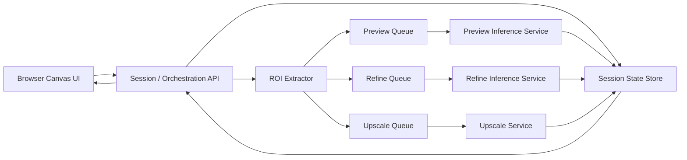

# Krea-Like Product Blueprint

## Goal

Build a browser-based AI image editing product that feels real-time by combining:

- prompt-driven generation
- reference-image conditioning
- mask and brush editing
- region-of-interest regeneration
- burst preview
- async refine
- async upscale

The first product milestone is not "best final image quality." It is:

`Make editing feel immediate without collapsing quality later.`

## Architecture Overview



## Core Product Loop

1. User changes prompt, mask, brush, reference, or region.
2. Frontend computes and sends a `CanvasEvent`.
3. Backend merges the event into `SessionState`.
4. Backend computes a `ROI`.
5. Backend submits a `PreviewJob`.
6. Preview service generates `4-8` low-step variants for the ROI.
7. UI composites the burst results into the working frame.
8. After idle or explicit commit, backend submits a `RefineJob`.
9. After variant selection, backend submits an `UpscaleJob`.

## Public Interfaces

### CanvasEvent

```ts
type CanvasEvent =
  | { type: "brush"; strokeId: string; points: number[]; color: string; size: number; layerId: string }
  | { type: "erase"; strokeId: string; points: number[]; size: number; layerId: string }
  | { type: "mask.update"; maskId: string; points: number[]; mode: "add" | "subtract" }
  | { type: "prompt.update"; positive: string; negative?: string }
  | { type: "reference.add"; assetId: string; uri: string }
  | { type: "reference.remove"; assetId: string }
  | { type: "region.set"; x: number; y: number; width: number; height: number }
  | { type: "image.import"; assetId: string; uri: string; x: number; y: number };
```

### PreviewJob

```ts
type PreviewJob = {
  sessionId: string;
  roi: { x: number; y: number; width: number; height: number };
  prompt: { positive: string; negative?: string };
  references: string[];
  burstCount: number;
  seedMode: "increment" | "random";
  previewModel: "sdxl-turbo" | "flux-schnell";
};
```

### RefineJob

```ts
type RefineJob = {
  sessionId: string;
  sourceVariantId: string;
  roi: { x: number; y: number; width: number; height: number };
  prompt: { positive: string; negative?: string };
  references: string[];
  refineModel: "qwen-image-edit" | "flux-kontext";
};
```

### UpscaleJob

```ts
type UpscaleJob = {
  sessionId: string;
  sourceImageId: string;
  targetLongEdge: number;
  mode: "fast" | "high-detail";
};
```

### SessionState

```ts
type SessionState = {
  sessionId: string;
  layers: Array<{ id: string; assetId?: string; visible: boolean }>;
  masks: Array<{ id: string; layerId?: string }>;
  prompt: { positive: string; negative?: string };
  references: string[];
  activeRoi?: { x: number; y: number; width: number; height: number };
  seedHistory: number[];
  selectedVariantId?: string;
};
```

## Lane Responsibilities

### Preview Lane

Responsibilities:

- accept ROI jobs
- produce `4-8` candidates fast
- optimize for first-pixel latency, not final image quality

Default models:

- `SDXL-Turbo`
- `FLUX.1-schnell`

Rules:

- never block on upscale
- avoid full-frame rerender unless explicitly required
- prioritize `time to first candidate`

### Refine Lane

Responsibilities:

- improve semantic fidelity
- preserve intent and reference consistency
- run after pause or user commit

Default models:

- `Qwen-Image-Edit`
- optional benchmark lane with `FLUX Kontext`

### Upscale Lane

Responsibilities:

- enlarge accepted outputs
- restore detail after the user has chosen a direction

Rules:

- always detached from the preview loop
- cancel stale upscale jobs when the user keeps editing

## Queue Design

- `preview` queue has the highest priority
- `refine` queue runs after preview and can be canceled if the user edits again
- `upscale` queue runs only for selected images

Cancellation behavior:

- new canvas edits invalidate in-flight refine jobs for the same ROI
- upscale jobs are invalidated when the selected variant changes

## Data Flow Rules

- store prompts, masks, ROI, and reference IDs in `SessionState`
- store image assets separately from session metadata
- keep `seed history` because burst candidate replay is useful for user trust and debugging
- version the session state so stale preview/refine results can be discarded safely

## Product Phases

### Phase 1: Convincing PoC

- custom browser canvas
- ROI tracking
- prompt + references
- `4` preview variants
- preview lane with `SDXL-Turbo`
- refine lane with `Qwen-Image-Edit`
- simple result selection

Success criterion:

The product feels obviously faster than a standard img2img workflow and proves the interaction model.

### Phase 2: Latency Optimization

- add `FLUX.1-schnell` benchmark path
- optimize ROI packing and compositing
- tune burst size and queue policies
- add idle-triggered refine
- add cancellation semantics and stale-result dropping

Success criterion:

First useful preview appears in under one second on the target production GPU tier.

### Phase 3: Production Hardening

- model routing
- session durability
- job retries and observability
- GPU pool management
- usage limits, quota, and concurrency controls

Success criterion:

The system remains responsive and predictable with real user sessions and concurrent load.

## Recommended First Benchmarks

- `1024` prompt-only preview burst
- `1024` image+prompt preview burst
- `512-768 ROI` mask edit burst
- refine after `500-800 ms` idle
- upscale after explicit selection

## Why Preview-Fast + Refine-Later Is Mandatory

This is the main design law of the product:

- the user judges responsiveness from the first visible candidate
- the user judges quality after they commit to a direction

Those are different moments, so they must be served by different lanes.
